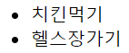
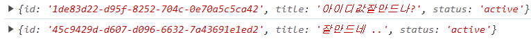

# TodoList react 구현

## d-1 map함수 이용하여 array형식 state출력하기



```
const [todo, setTodo] = useState([
    { id: 1, title: "치킨먹기", status: "진행중" },
    { id: 2, title: "헬스장가기", status: "진행중" },
  ]);
```

```
      <ul>
        {todo.map((v, i) => {
          return <li key={v.id}>{v.title}</li>;
        })}
      </ul>
```

todo 라는 array 형식의 state에 id,title,status 값을 보관하는 객체를 입력했습니다.
추후 입력값에 따라 동적으로 진행하기 위해 map 함수로 배열을 복사해 li 태그 값을 출력했습니다.
localstorage에 배열을 보관하고 배열값을 다시 출력하는 식으로 진행 할 예정입니다.

## d-2 추가기능구현

```
const AddTodo = ({ onAdd }) => {
  const [txt, setTxt] = useState("");
  const handleChange = (e) => {
    setTxt(e.target.value);
  };
  const handleSubmit = (e) => {
    e.preventDefault();
    if (txt.trim() == "") {
      return false;
    }
    onAdd({ id: Date.now(), title: txt, status: "active" });
    setTxt("");
  };
```

```
   <form onSubmit={handleSubmit}>
      <input
        type="text"
        placeholder="Add Todo"
        name="todo"
        value={txt}
        onChange={handleChange}
      />
      <button>Add</button>
    </form>
```

input 의 value값을 txt라는 state에 담고 onchange이벤트가 일어날때마다 state 변경값을 적용했습니다
if (txt.trim() == "") {return} 이라는 조건문을 사용하여 공백이나 여백이 포함된 공백이 존재하면 submit을 막는 기능도 구현했습니다.

## 문제점 및 개선방안

### 더 유니크한 아이디값 찾기(문제점)

onAdd 는 부모 컴포넌트에서 빌려온 props인데 id값은 now date 함수를 이용해주었다. 같은시간 같은 ms에
소규모 서비스에 동일한 아이디가 만들어질 확률은 적지만 math함수나 timestamp류 함수를 쓰지않고 새로운 방법으로
유니크한 아이디값을 가져오는 방법을 찾고싶었다.

#### [라이브러리]uuid (개선방안)

uuid 라는 라이브러리를 알게되었다. import하는 버전에 따라 내가 수기로 입력한 timestamp id도 할당해주고
버전값을 업할수록 좀 더 복잡한 로직의 id값을 할당해준다.
리액트에서는 npm i react-uuid 라는 명령어로 쉽게 설정가능


터미널

npm i uuid

uuid()로 호출가능 import 꼭 해줘야함

### [라이브러리] 리액트아이콘

npm i react-icons

## day-3 필터적용하기
